# Awesome C++ Project in GitHub
- Create a simple calculator

## CI Status
Status | Build Type
------ | ----------
[](https://github.com/iwatake2222/cpp_project_in_github/actions/workflows/cmake_x64.yml) | windows-latest, ubuntu-latest, macos-latest
[](https://github.com/iwatake2222/cpp_project_in_github/actions/workflows/cmake_arm.yml) | armv7 + ubuntu18.04, aarch64 + ubuntu18.04
[](https://github.com/iwatake2222/cpp_project_in_github/actions/workflows/codeql-analysis.yml) | ubuntu-latest

## How to Run
### Linux
```sh
git submodule update --init --recursive --recommend-shallow --depth 1
mkdir -p build && cd build
cmake ..
make
ctest
./main
```

### Visual Studio
- Create a Visual Studio project using cmake-gui
- Build the project
- Normal execution
    - Set `main` as a startup project
    - Run
- Test
    - Open Test Explorer
    - Run All Tests


# License
- Awesome C++ Project in GitHub
- https://github.com/iwatake2222/cpp_project_in_github
- Copyright 2021 iwatake2222
- [Licensed under the Apache License, Version 2.0](LICENSE)

# Acknowledgements
- This project utilizes OSS (Open Source Software)
    - [NOTICE.md](NOTICE.md)


---------------------------------------------------------------
---------------------------------------------------------------
---------------------------------------------------------------
---------------------------------------------------------------

# ここからは、プロジェクトの設定に関する説明です


# GitHubでC++プロジェクトを開発する際にやっておきたい設定
- 簡単な電卓アプリ開発を例に、以下を行います
    - GitHub上でのIssueテンプレート、マイルストーン、Projectsの設定
    - GitHub Flowを例にした簡単な開発の流れの説明
    - CMakeを用いた、C++プロジェクトの用意
    - Google Testを用いたUnitTestの導入
    - GitHub Actionsを用いた、CI/CDの導入
        - クロスプラットフォーム (Windows, Linux, MacOS, Linux(ARM))
    - GitHub Actionsを用いた、コードの静的解析

- この記事では、開発の方法論はおまけとして、それを支えるためのツールの設定方法に重点を置きます
- 1人でやる個人開発～数名規模での開発は本記事の内容でカバーできると思います。もっと複雑になると別の仕組みが必要になってきそうです
- 本記事の設定を全てやる必要はなく、必要そうな項目を取捨選択していただければと思います。たとえば、趣味の開発の場合にはマイルストーン設定はいらないかと思います

# プロジェクト概要 (架空)
- 架空の顧客から以下のような要求を受け、開発を行うとします
- 作りたいもの
    - 電卓アプリが欲しい
    - 入力はターミナル上のキーボードで、出力はターミナル
    - 足し算、引き算、掛け算が出来ればよい
    - 入力は整数のみ
    - Windows, Linux, MacOSで動かしたい。もしかしたらラズパイでも動かすかも
- スケジュール
    - 2021/12/29: 動作確認用に、入出力と、何か1つの計算が出来るものを提供してほしい
        - これをAlpha Releaseと呼ぶ
    - 2021/12/30: 全ての機能が実装され、バグがない状態のものを提供してほしい
        - これをFinal Releaseと呼ぶ

*趣味の開発の場合は、上記のようなものを作りたいと、何となく頭に浮かんできた、という状態をイメージしてください。この場合スケジュールはないと思います。(それでもある程度の目標はあった方がよいかと思いますが)

# GitHub上でプロジェクトを用意する
## GitHubのNew repositoryからリポジトリを作る
- 本記事では、最初にGitHubのwebサイト上でリポジトリを作ります (先にローカルで作っていても、後から追加できます)
    - 名前は、「cpp_project_in_github」とします
    - `README.md` 、`.gitignore` 、`LICENSE` を追加します
    - これらは後でやっての良いのですが、出来るだけ早いタイミングでやるようにしましょう

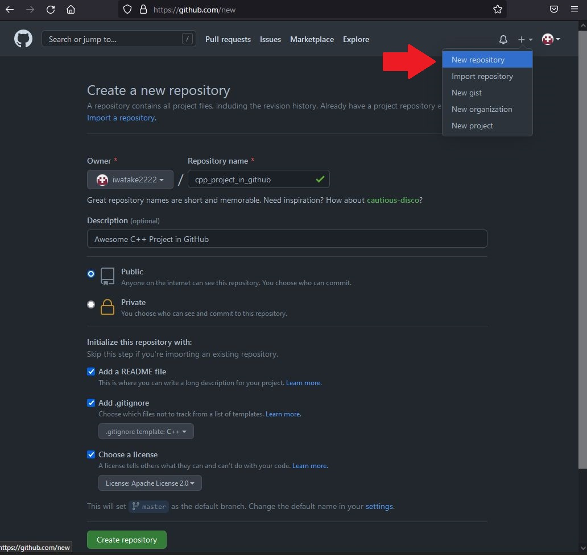

- リポジトリのトップページ -> 右上少し下の歯車 (Edit repository details)で、このプロジェクトの説明やTopics(タグ)などを追加しておきます

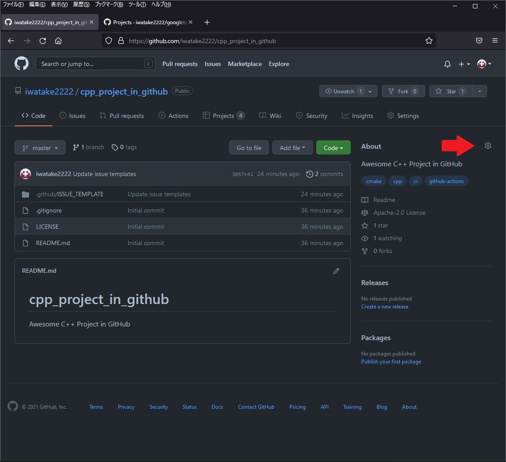

## Issueテンプレートの設定
- リポジトリもできたし、あとはcloneして開発開始だ! となる気持ちはわかるのですが、その前に諸々の設定をします
- まずIssueテンプレートの設定をします。これによって、issueを作るときのひな形を用意します
- issue(チケット)ドリブンで開発する際に、ちゃんとissueを書こうという気になります。また、プロジェクト公開後にクソみたいなissueを防ぐことにつながります
- リポジトリのトップページ -> Settings -> Options -> Features -> Issues -> Set up templates

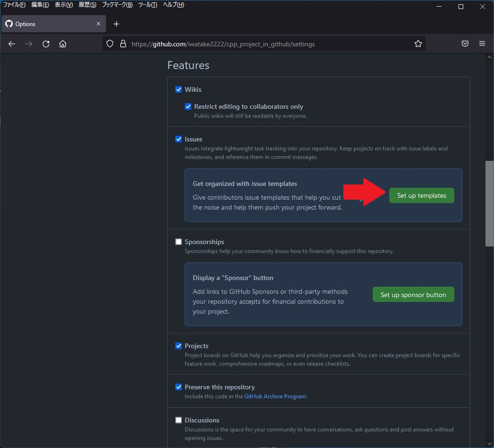

### Issueテンプレートを追加する
- Add templateから、Bug reportとFeature requestを追加します
    - 他に必要そうなものがあればそれも追加します
- 自分のプロジェクトにあった形式に編集します
    - このとき、Issue default titleも設定しておくと後で見やすくなっておすすめです
- Propose changesで変更をcommitする

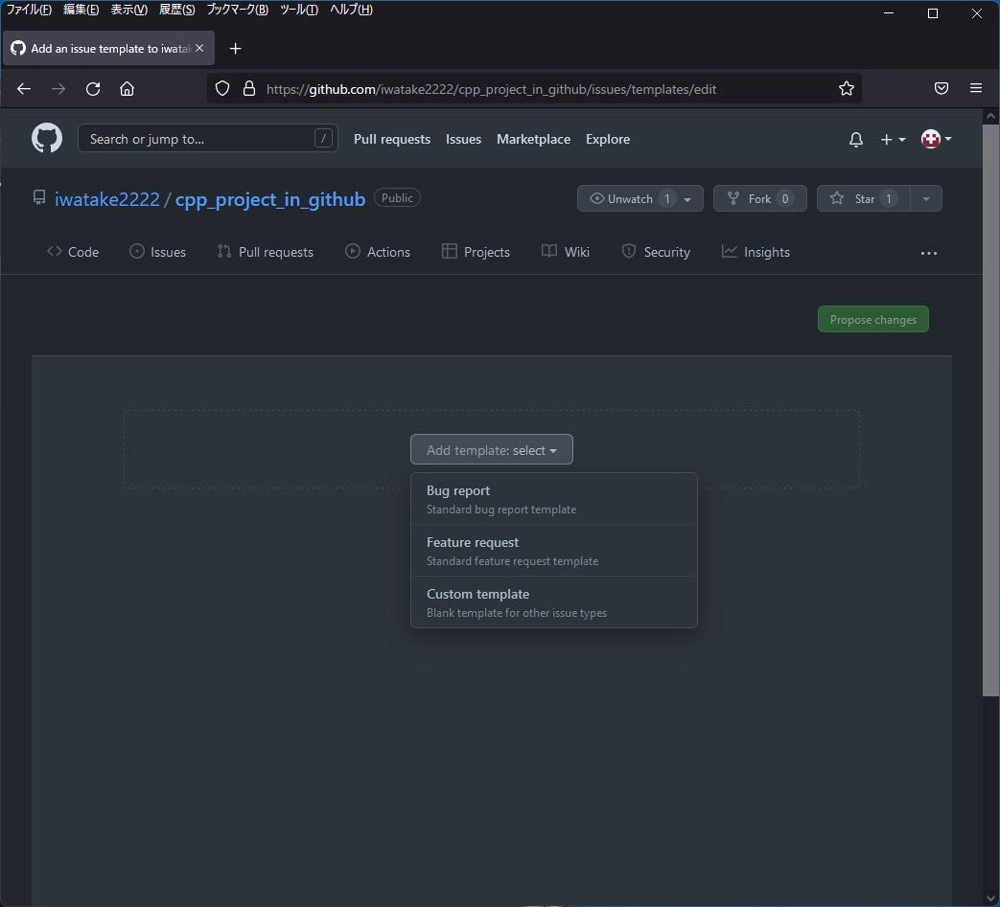


## Issueラベルの設定
- リポジトリのトップページ -> Issues -> Labelsを選びます
- 最初からよく使うラベルが追加されています。しかし、今回は1から新しいアプリを作るわけですが、それに対応するのがありません
- New labelをクリックし、例えば「basic function」を追加します。今回のAlpha Release、Final Release向けの最初の機能開発にはこのラベルを使うことにします

## マイルストーンの設定
- 今回は明確なスケジュール(リリース日)があるので、それに合わせてマイルストーンを作成します
    - これによって、各締め切りに対しての進捗管理がしやすくなります (後でフィルタリングできたりします)
- リポジトリのトップページ -> Issues -> Milestonesを選びます
- New milestoneをクリックし、例えば以下のようなmilestoneを追加します
    - 1つめ
        - Title: Alpha Release
        - Due data: 2021 / 12 / 29
    - 2つめ
        - Title: Final Release
        - Due data: 2021 / 12 / 30

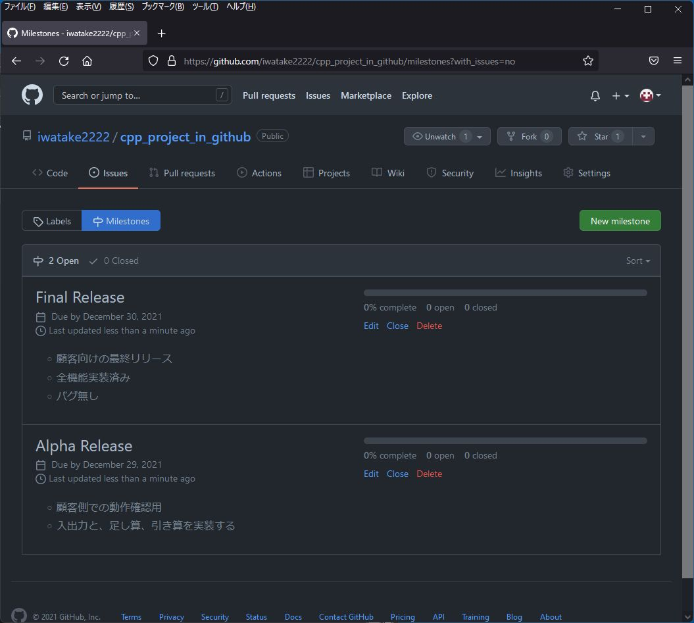

## Projectsの設定
- Issue(機能実装、バグ)のステータスを見やすくするため、Projectsを作成します。これはいわゆるKANBAN(Project board)です
- 新しいProjects(beta)が最近追加されましたが、ここでは旧Projectsを使うことにします
    - 新しいProjects(beta)だとリスト表示や複数のビュー管理、ワークフロー設定ができるため便利そうです
    - が、Projects自体はユーザに紐づいて作成され、それをリポジトリに追加するという方針らしいです (複数リポジトリをまたいだ開発も想定しているためだと思います)
    - 自分のプロフィールに今回の説明用Projectsが出来るのが嫌なので、ここでは旧Projectsを使うことにしました

- リポジトリのトップページ -> Projects -> Projectsを選びます
- New projectをクリックし、例えば以下のようなProjectsを追加します
    - 1つめ
        - Project board name: Create Simple Calculator
        - Template: Automated kanban
    - 2つめ
        - Project board name: Bug Tracking
        - Template: Bug triage
- Projectsを作ると、最初にサンプルのノート(アイテム)がTo doの列に用意されるので消しておきます
- 今回のFinal Releaseまでの通常の開発は全てCreate Simple Calculatorで見ることにします。アイテムが増えてくると、KANBANの列に入りきらず見づらくなるのですが、milestoneでフィルタをかけることができます。milestoneごとにProjectsを分けるのもありだとは思います。(が、実際はそんなうまいこと開発はすすまずに、やり残しのタスクが発生したりするので、同じにしておいた方が良いかと。。。)
- 例えば将来の大幅アップデートや、リファクタリング、少し大規模な新規機能開発を行う際に、新しいProjectsを用意するとよいかと思います

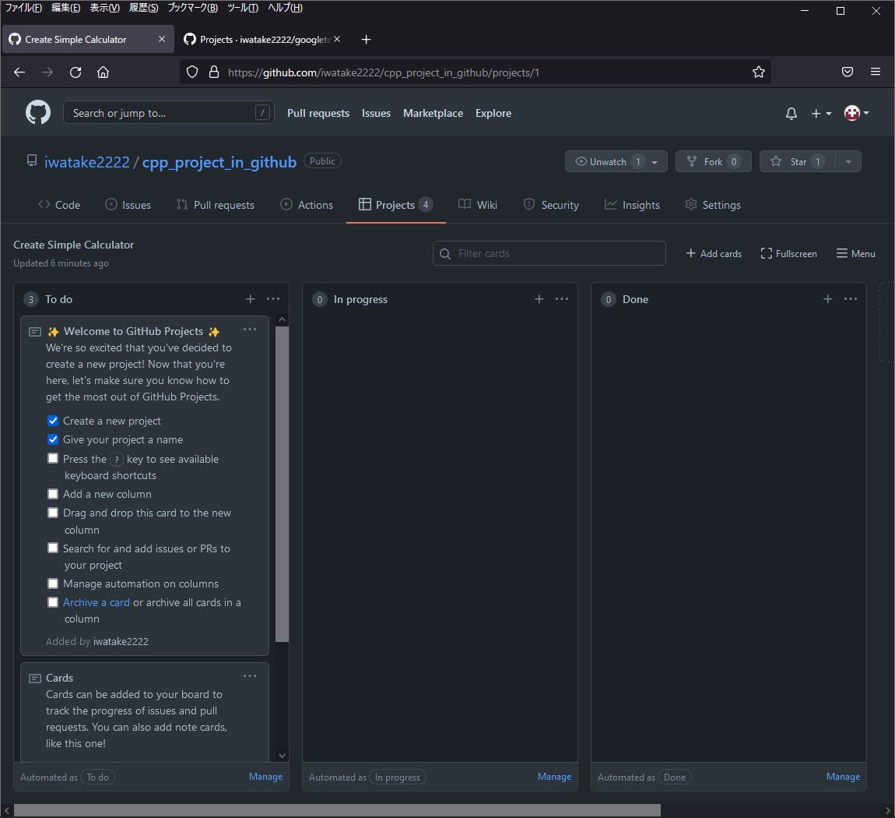

## Wikiの設定
- 活用できそうだったら有効にしてください
- ビルド方法などはここに書いてもいいかもしれません
- *最近知ったのですが、このwikiもgitとして管理できるようです


# Issueの追加
- これでようやく下準備が整いました。ここまでの内容は、チーム開発の場合にはPM, PL, POがやることもあるかと思います
- ここからいざ開発! といきたいのですが、その前にタスクリストとしてissueを作成しておきます

## Issueの追加
- リポジトリのトップページ -> Issues -> Feature requestから作成します
    - Feature requestではないような気もしますが。。。気になる場合は別のissue templateを作成してください
- 例えば以下のようなissueを追加します。環境整備系も追加しておきます
    - 空プロジェクトの用意
    - ユニットテスト環境の用意
    - CI/CD環境の用意
    - 計算モジュールの開発
    - 足し算機能の実装
    - 引き算機能の実装
    - 掛け算機能の実装
- Assigneesに、担当者を設定します
- Labelsに、basic functionを設定します
- Projectsに、先ほど作成したCreate Simple calculatorを設定します
- Milestoneに、Alpha Releaseを設定します
    - 「掛け算機能の実装」はFinal Releaseを設定

## Issue追加後の状態
- Issueを追加したら、IssuesとProjectsは以下のようになります
- まず最初に、「空プロジェクトの用意」をやる予定なので、これをIn Progressに移動しています

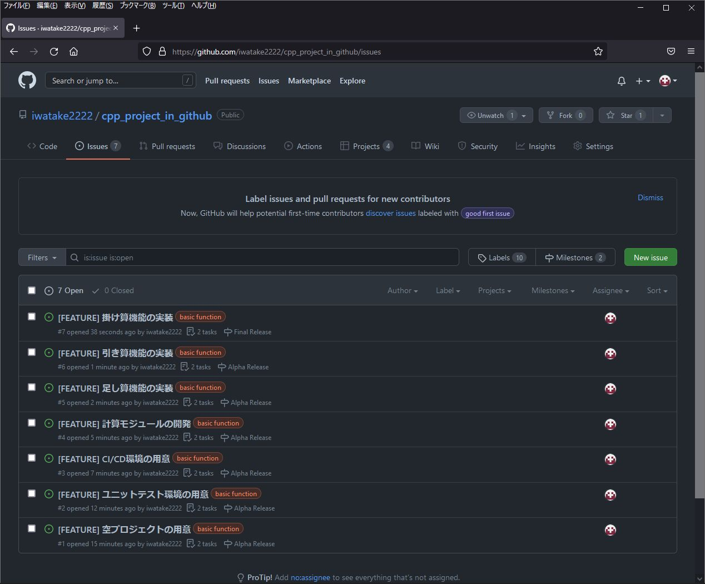

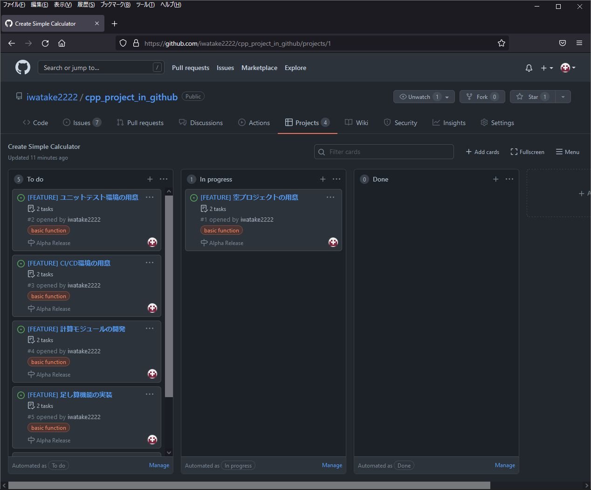

# 空プロジェクトの用意
- ここからようやく、いわゆる開発が始まります
- いつも通りこのリポジトリをcloneします
- まずは、「空プロジェクトの用意」の対応をします

## topicブランチを作る
- これから、`[FEATURE] 空プロジェクトの用意 #1` に対応する作業をするので、topicブランチを作ります
- 命名規則はチームに従えばいいのですが、例えば以下のようにします
    - 機能開発の場合: `git checkout -b feature-#123-ooo`
    - バグ修正の場合: `git checkout -b fix-#123-ooo`
    - (#は無いほうがいいかも)
- ここでは `git checkout -b feature-#1-empty_project` とします

## Hello worldプロジェクトを追加する
- 「空プロジェクト」といっても、何かしらの動きはしてほしいので、適当にハローワールドを出します
- また、CMakeLists.txtではgccのコンパイルオプションなども行います
- このとき、使用するライセンスにもよりますが、ソースコードのヘッダにライセンス情報をつけることを忘れないようにします

- [CMakeLists.txt](https://github.com/iwatake2222/cpp_project_in_github/blob/b9aa5faf21dc8d5d78a61593c7f7b1c780bb75ab/CMakeLists.txt)
- [cmakes/compile_option.cmake](https://github.com/iwatake2222/cpp_project_in_github/blob/b9aa5faf21dc8d5d78a61593c7f7b1c780bb75ab/cmakes/compile_option.cmake)
- [main.cpp](https://github.com/iwatake2222/cpp_project_in_github/blob/b9aa5faf21dc8d5d78a61593c7f7b1c780bb75ab/main.cpp)

## ドキュメントの整備
- リポジトリ作成時にドキュメントが自動生成されましたが、少し手直しします

### .gitignoreの編集
- 自分(またはチーム)の環境に合わせて変更してください
- 僕はいつも以下を追加しています

```
.vscode
build/
```

- [.gitignore](https://github.com/iwatake2222/cpp_project_in_github/blob/b9aa5faf21dc8d5d78a61593c7f7b1c780bb75ab/.gitignore)

### NOTICE.mdの追加
- このプロジェクトで使用している、他のOSSに関する情報を記載します
- 現時点では無くても、とりあえずファイルを追加しておけばいざ必要になった時にどうしようかと悩んだり記載をサボることがなくなると思います

```txt: NOTICE.md
## ooo
- https://github.com/ooo/ooo
- Copyright 20xx ooo
- Licensed under the ooo License
- Modification: No

copy of the license 
```

- [NOTICE.md](https://github.com/iwatake2222/cpp_project_in_github/blob/b9aa5faf21dc8d5d78a61593c7f7b1c780bb75ab/NOTICE.md)

### CHANGELOG.mdの追加
- 後でリリースするときに、リリースノートに記載される変更点をまとめたものです
- これは無くてもいいかも

- [CHANGELOG.md](https://github.com/iwatake2222/cpp_project_in_github/blob/b9aa5faf21dc8d5d78a61593c7f7b1c780bb75ab/CHANGELOG.md)


### REAEDME.mdの編集
- READMEに以下の内容を追加しておきます
    - プロジェクト概要の説明
    - ビルド方法
        - これはwikiでもいいかも
    - 本プロジェクトのライセンス情報
    - サードパーティのOSS等の使用情報

- [README.md](https://github.com/iwatake2222/cpp_project_in_github/blob/b9aa5faf21dc8d5d78a61593c7f7b1c780bb75ab/README.md)

## topicブランチをpushする
```sh
git add .
git commit -m "Add empty project"
git push origin master feature-#1-empty_project
```

## topicブランチからmasterブランチへのプルリクを発行する
- リポジトリのトップページ -> Compare & pull request をクリック
    - base: master <- compare feature-#1-empty_project
    - コメントに以下を記載する (大事！)
        - `Close #1`
    - Create pull requestする
    - 必要に応じてReviewersを設定する

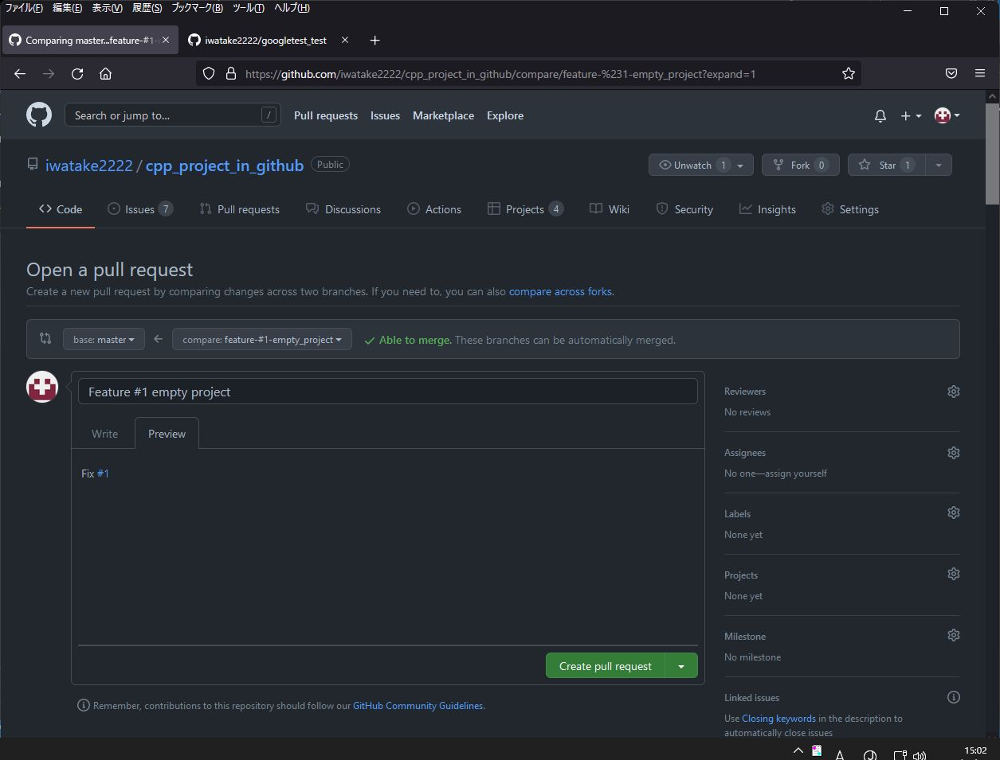


- メモ
    - プルリクもProjects boardで管理することができます。が、すでにissueを登録しているのでissueとプルリクが1:1で対応している場合には冗長かなとおもいます
    - プルリクのコメントに`Fix`や `Close`を含めることで、マージ後に自動的にissueが閉じます
    - commitメッセージに入れても同じ扱いになります。が、1つのissueに複数のcommitが入ることもあるので、プルリクのコメントに入れる方が僕は好きです

## topicブランチからmasterブランチへのプルリクをマージする
- 適切な人がプルリクを、Merge pull request -> Confirm merge します
    - https://github.com/iwatake2222/cpp_project_in_github/pull/8
- 終わったら、Delete branchします
- 完了したらこのissueは自動的にClosedになります。また、Project board上でもDoneに移動します
- また、自分のPC上でmasterブランチに戻り、git pullしておきます **大事**

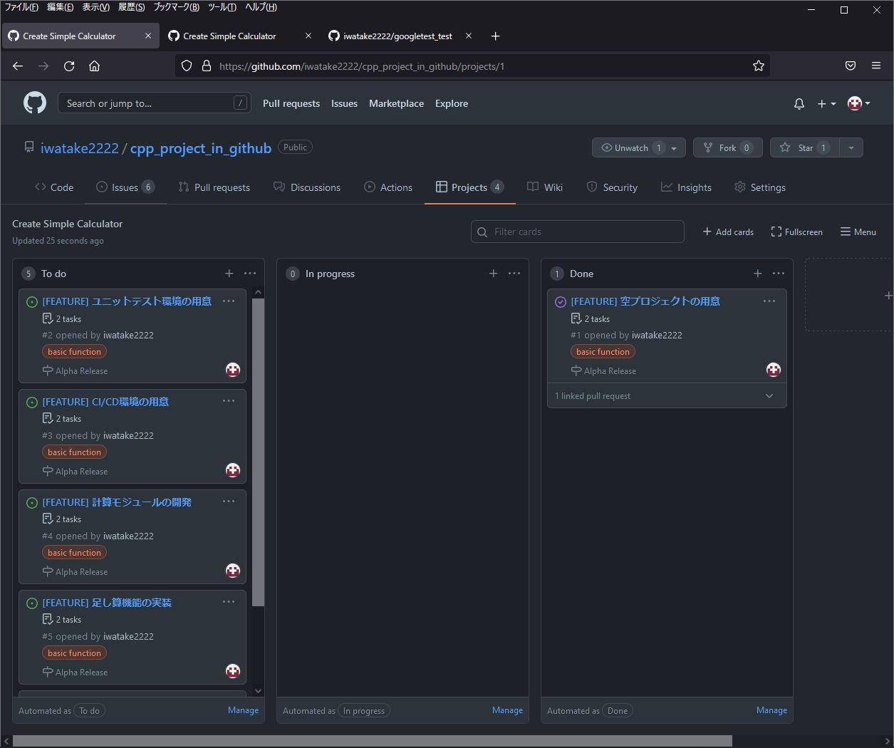

# GitHub Flow
- このようにブランチを切って開発し、プルリクを出してmasterブランチにマージしていく方式はGutHub Flowと呼ばれています
- 先ほどはその説明も記載したため長くなってしまいましたが、以後はgitやブランチ操作についての説明は省略します。が、ちゃんとやるようにしましょう


# Google Testを用いたUnitTestの導入
- 次に、ユニットテスト環境を導入します
    - 事前に、`git checkout -b feature-#2-include_unittest` しておきます
- 今回はGoogleTestを使います https://github.com/google/googletest

## テスト用フォルダの用意
- テストをどこに書くかという議論はありそうですが、今回はシンプルにルートフォルダの下に`test` というフォルダを作り、そこでプロジェクト本体と同じ構造を再現し、各フォルダ(モジュール)に対応するテストを書いていくことにします

```
/main.cpp
/sub_module_a/    <- SubModuleA本体
/sub_module_b/    <- SubModuleB本体
/test/
    - /main/            <- mainのテスト(不要だが、サンプルとして用意)
    - /sub_module_a/    <- SubModuleAのテスト
    - /sub_module_b/    <- SubModuleBのテスト
```

## ルートフォルダのCMakeLists.txtを編集
- testフォルダを追加したので、それを呼ぶようにします

- [CMakeLists.txt](https://github.com/iwatake2222/cpp_project_in_github/blob/03f72fb4c20abba4500c657211ad786adb0c492e/CMakeLists.txt)

## GoogleTestの導入
- 導入方法は https://google.github.io/googletest/quickstart-cmake.html#set-up-a-project に書いてある通りです
- 公式の方法ではCMakeのFetchContent_DeclareでGoogleTestを取ってきています。が、これは自分の好みになるのですがgitのsubmoduleで管理する方が好きだったりします
    - 必要になった場合、編集がしやすい
    - cmakeの設定を色々と弄っていると、buildフォルダを全消しすることがよくあるが、その際に再ダウンロードが不要
    - (どちらもコードのダウンロード先を変えればいいのですが、それもどこに置くかとか悩むのがだるいので。。。)
- submodule方式でGoogleTestを導入する場合は以下を実行しておきます。FetchContent_Declareを使う場合はこの手順は不要です

    ```sh
    mkdir -p test/third_party
    git submodule add https://github.com/google/googletest test/third_party/googletest
    cd test/third_party/googletest
    git checkout release-1.11.0
    ```


- 以下のようなCMakeLists.txtをtest直下に用意します

- [test/CMakeLists.txt](https://github.com/iwatake2222/cpp_project_in_github/blob/03f72fb4c20abba4500c657211ad786adb0c492e/test/CMakeLists.txt)

## サンプルのテストケースを実装
- main関数のテストをするわけではないのですが、今後他のモジュール開発者が参考にできるように、`test/main/` というフォルダを作り、その中にシンプルなテストケース例を実装します

- [test/main/CMakeLists.txt](https://github.com/iwatake2222/cpp_project_in_github/blob/03f72fb4c20abba4500c657211ad786adb0c492e/test/main/CMakeLists.txt)
- [test/main/test_main.cpp](https://github.com/iwatake2222/cpp_project_in_github/blob/03f72fb4c20abba4500c657211ad786adb0c492e/test/main/test_main.cpp)

## テストを実行する
```sh
mkdir -p build && cd build
cmake ..
make
ctest
```

```txt:実行結果(ctest)
iwatake@iwatake_desktop:/mnt/c/iwatake/devel/devel/cpp_project_in_github/build$ ctest
Test project /mnt/c/iwatake/devel/devel/cpp_project_in_github/build
    Start 1: TestMain.BasicTest
1/1 Test #1: TestMain.BasicTest ...............   Passed    0.01 sec

100% tests passed, 0 tests failed out of 1

Total Test time (real) =   0.06 sec
```

上記のように100% tests passedになればOKです。
ちなみに、testの実行ファイルをそのまま実行すると、かっこいい出力が出ます。が、普段は面倒なのであまり使わないです

```txt:実行結果(テストの実行ファイル)
iwatake@iwatake_desktop:/mnt/c/iwatake/devel/devel/cpp_project_in_github/build$ ./test/main/TestMain
Running main() from /mnt/c/iwatake/devel/devel/cpp_project_in_github/test/third_party/googletest/googletest/src/gtest_main.cc
[==========] Running 1 test from 1 test suite.
[----------] Global test environment set-up.
[----------] 1 test from TestMain
[ RUN      ] TestMain.BasicTest
[       OK ] TestMain.BasicTest (0 ms)
[----------] 1 test from TestMain (0 ms total)

[----------] Global test environment tear-down
[==========] 1 test from 1 test suite ran. (0 ms total)
[  PASSED  ] 1 test.
```

## ドキュメントの更新
- 今回新たにテストを実行できるようになったので、その方法をREADMEに追加しておきます
- また、GoogleTestを導入したのでNOTICEに追加しておきます (配布物に含めるわけではないし、ソースコード自体を保持しているわけでもないので、恐らくルール的には必須ではないと思うのですが、Acknowledgements(謝辞)ということで)

## マージする
- 先ほどと同様に、
- `git push origin feature-#2-include_unittest`
- GitHub上でプルリク発行
    - Close #2
- GitHub上でマージ、ブランチ削除
    - https://github.com/iwatake2222/cpp_project_in_github/pull/9
- `git checkout master`
- `git pull`


# GitHub Actionsを用いた、CI/CDの導入
## やりたいこと
- ここまでで、Issue(チケット)駆動開発的なこと、プロジェクトのKANBAN管理、ユニットテストができるようになりました
- 本格的に開発を始める前に、GitHub Actionsを使ってCI(Continuous Integration)とCD(Continuous Delivery)を実現しておきます
- 具体的には以下を行うようにします
- CI:
    - masterブランチへpush/プルリクが発生したら、ビルドとテストを実施する
    - 環境は、Windows, Linux, MacOS、Linux(armv7)、Linux(aarch64)
    - ビルド結果(実行ファイルである`main` ファイル)をダウンロードできるようにする
- CD:
    - タグがpushされたら、CIと同等のビルドをする
    - GitHub上でリリースを行う。その際、ビルド結果の実行ファイルとNOTICE.md等を添付する

## GitHub Actionsの設定 1
- GitHub Actionsの設定ファイルは`.github/workflows/*.yml` になります。自分で一から書いてもよいのですが、ベースとなるファイルをGitHubのページで作ります
- リポジトリのトップページ -> Actions を選び、「CMake based projects」をConfigureします
- その後、ymlファイルを編集する画面になるですが、ひとまずそのままcommitします (右上のStart commitをクリック)

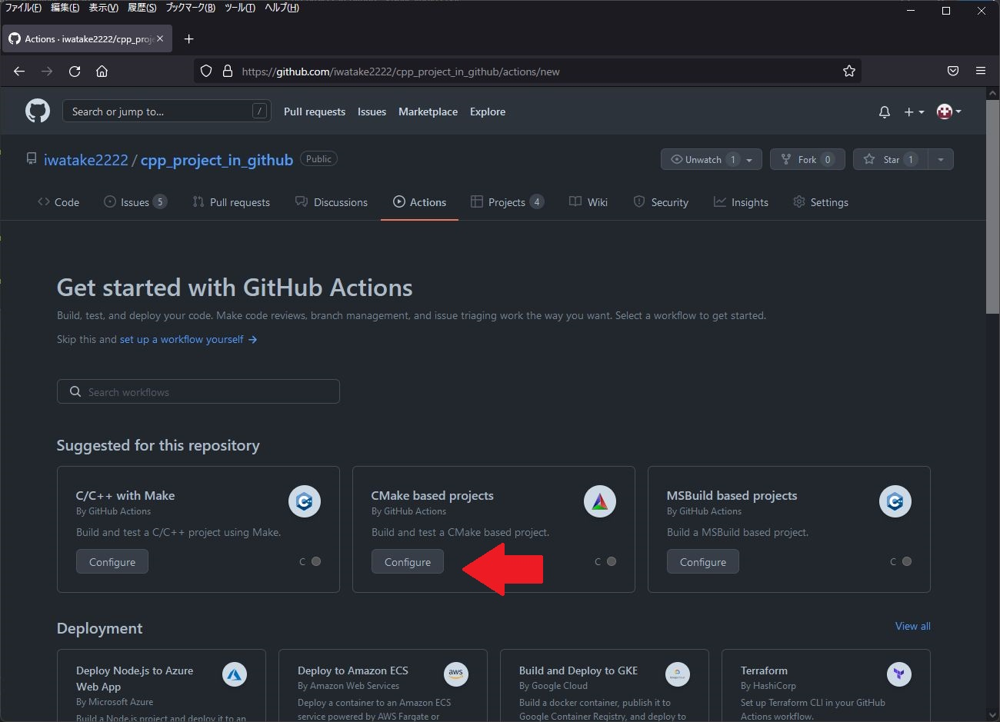

- commit完了後、再度Actionsのタブを見ます。すると以下のように今追加したGitHub Actionsが動いているはずです (下記は実行がエラーで終わっています)
- これからこのyamlファイルを編集していくので、`git pull` しておきます
- その後、`git checkout -b feature-#3-introduce_cicd` しておきます

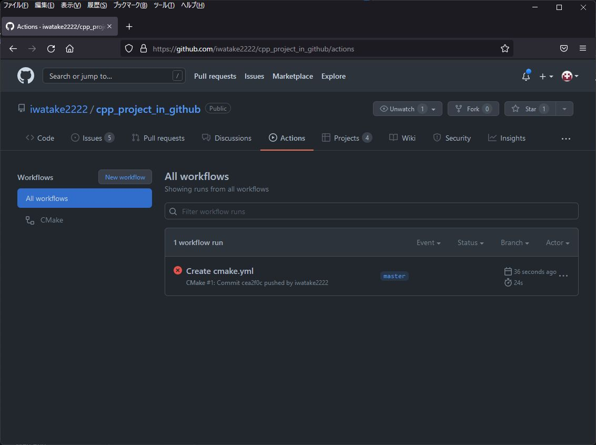

## GitHub Actionsの設定 2
- GitHub Actionsの設定の方針
    - GitHub Actionsには、何をトリガーにして(on)、どういう処理を実行するか(job)、を記載します
    - 今回は、pushが発生したらビルドとテスト、そしてビルド結果をartifactsとして保存。tagがpushされたらリリースをするようにします
    - リリースする際にはビルドも実行する必要があるため、以下のような全部入りの設定を作ります (お作法的に良いのかどうかは不明。。。)
        - ビルドstep
        - テストstep
        - artifactsの保存step
        - リリースstep (tag pushの場合だけ実行)
            - 今回、タグ名はチェックせずに、タグが作られたら常にリリースするようにします。本来はプリフィクスが「v」の場合だけリリースを走らせた方がよいです
- クロスプラットフォームのために
    - GitHub ActionsはデフォルトでWindows, Linux, MacOSという3つの環境で動かすことができます。通常はこれで事足ります
    - 今回はARM組み込み環境も考慮してみます。GitHub Actions自体はLinuxで動かし、そのうえでrun-on-arch-actioというworkflowを使います
- そのため、通常のPC用と組み込みARM用で設定の記載方法がそこそこ異なります。以下のように2つの設定ファイルを作ります。もともとあった`cmake.yml` は削除してOKです
    - [.github/workflows/cmake_x64.yml](https://github.com/iwatake2222/cpp_project_in_github/blob/45822685369dd466225f2ffbc60e21e5242eff45/.github/workflows/cmake_x64.yml)
    - [.github/workflows/cmake_arm.yml](https://github.com/iwatake2222/cpp_project_in_github/blob/45822685369dd466225f2ffbc60e21e5242eff45/.github/workflows/cmake_arm.yml)
- 本記事では細かい設定の説明は省略させてください
    - ちなみに、最初の`cmake.yml` でエラーが出たのは、GoogleTestをsubmoduleで含めているためです。FetchContent_DeclareでやっていればOKになっていたかもしれません

## マージしようとする
- 先ほどと同様に、
- `git push origin feature-#3-introduce_cicd`
- GitHub上でプルリク発行
    - Close #3

- いったんこの状態で、リポジトリのトップページ -> Actionsを見てみます
- すると、下記のように2つのworkflowが走っています。x64用は割と早く終わりますが、ARM用はDockerやQEMUを使っているためか時間がかかります
- また、workflowの実行結果を見ると、バイナリが添付されていることが確認出来ます。実際にこれらのバイナリはダウンロードしたら実行できます

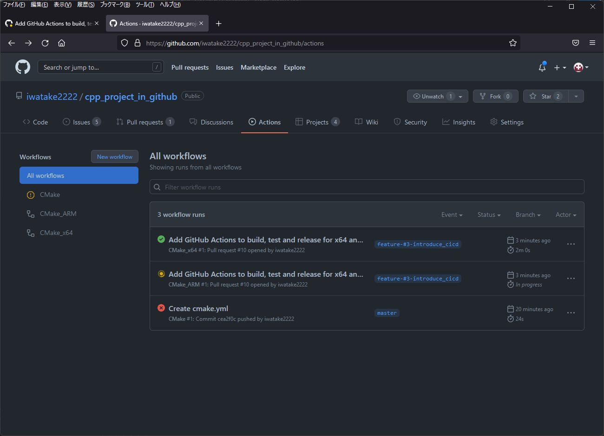

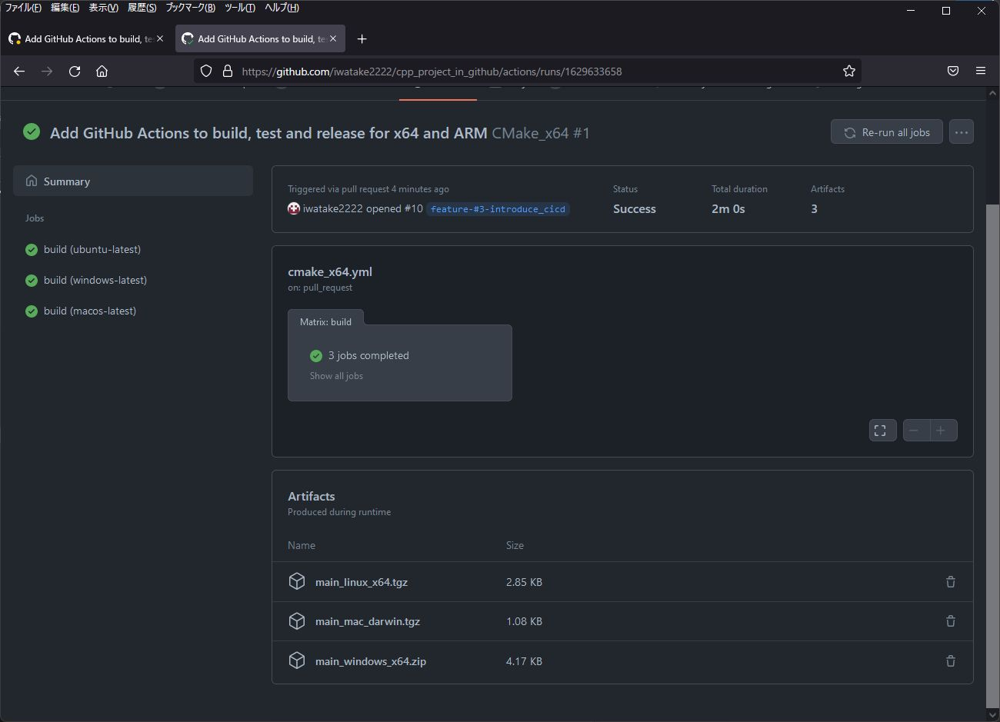


## マージする
- 追加したCIが通ったことを確認したら、先ほどと同様にマージを完了させます
    - https://github.com/iwatake2222/cpp_project_in_github/pull/10
- GitHub上でマージ、ブランチ削除
- `git checkout master`
- `git pull`

## 自動リリース(CD) を確認する
- 先ほどは、masterへのpush、プルリクが発生した場合にbuildとtestが走るというCIの確認が出来ました
- 次に、タグをつけてpushしたら自動でリリースするという、CDの確認をします
- 以下のようにタグを作って、pushします
    - `git tag test_release_0.1`
    - `git push origin test_release_0.1`
- GitHubのActionsのページを見るとこのpushに対応したworkflowが走っているはずなので、完了するまで待ちます
- 完了すると下記のように自動的にリリースされていることがわかります。また、リリースに対して全プラットフォーム向けの実行ファイルが添付されていることがわかります

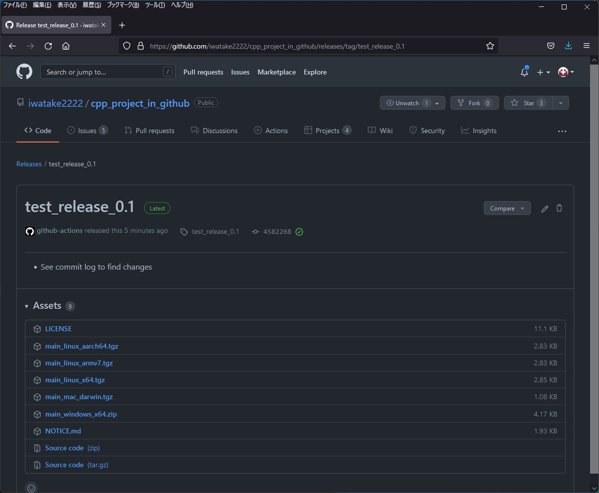


# GitHub Actionsを用いた、コードの静的解析
- コード品質を上げるために、静的解析ツールを導入します
- CodeQLというツールがGitHub Actions上で使えるので、これを使います
- リポジトリのトップページ -> Security -> Code scanning alertsのSet up code scannigをクリックします
- 次の画面で、CodeQL AnalysisカードのSet up this workflowをクリックします
- とりあえずそのままcommitします
- 少し手直しが必要なので、自分のpcで`git pull` しておきます
    - その後、` git checkout -b feature-#11-codeql` しておきます

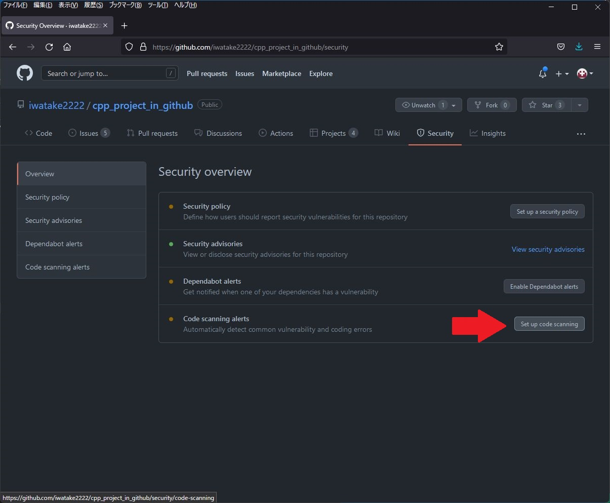
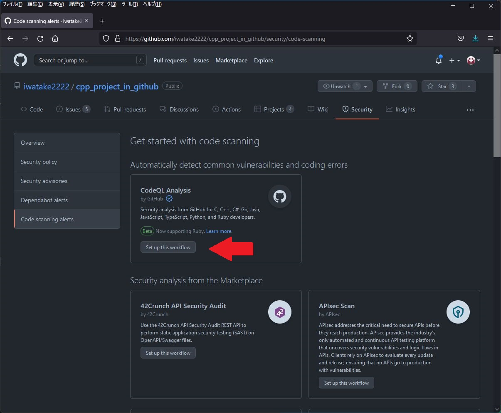

## CodeQLのworkflow設定
- CodeQLのworkflowはデフォルトではautobuildというworkflowを使って、自動でいい感じにビルドしようとしてくれます
- しかし、本プロジェクトはGoogleTestのためにgit submoduleを使っています。そのため、なにも考慮しないとソースコードがないとエラーが出てしまいます
- 以下の対応策があります
    - コマンドに`git submodule update --init --recursive --recommend-shallow --depth 1` をついかする
    - テストを省略する
- 今回はテストを省略することにします。理由はテスト自体はCIで走るし、他プロジェクトのコードにまで静的解析をかけたくないためです
    - GoogleTestレベルなら問題ないと思いますが、場合によってはサードパーティのコードで警告が出まくる可能性があって面倒です
- 設定を以下のように修正します
    - [.github/workflows/codeql-analysis.yml](https://github.com/iwatake2222/cpp_project_in_github/blob/a62eeeba315e0f23c7d4f591c1133cdc94bc75ee/.github/workflows/codeql-analysis.yml)

## 動作確認用にあえて危険なコードを入れる
- 静的解析ツールの動作確認のために、main関数に以下のようなコードを追加します

```c:main.cpp
/* Cause security warning */
char buffer[1];
buffer[3] = 1;
```

## READMEにバッジの追加
- せっかくCICDを導入したので、そのステータスがわかるようにバッジをREADMEに追加します
    - (このタイミングで入れるのは微妙ですが、ついでに追加してしまいます)
- Actionsのページで各workflowを選んだあと、右側の・・・をクリックすると、「Create status badge」が出てきます。それを選ぶことで、以下のようなリンクを取得できます
    - `[](https://github.com/iwatake2222/cpp_project_in_github/actions/workflows/cmake_x64.yml)`
- これをREADMEにいい感じに張り付けておきます
    - [README.md](https://github.com/iwatake2222/cpp_project_in_github/blob/a62eeeba315e0f23c7d4f591c1133cdc94bc75ee/README.md)
- うまくいくと、以下のように表示されます。また、CICDの状態がpassing or failureで表示されます

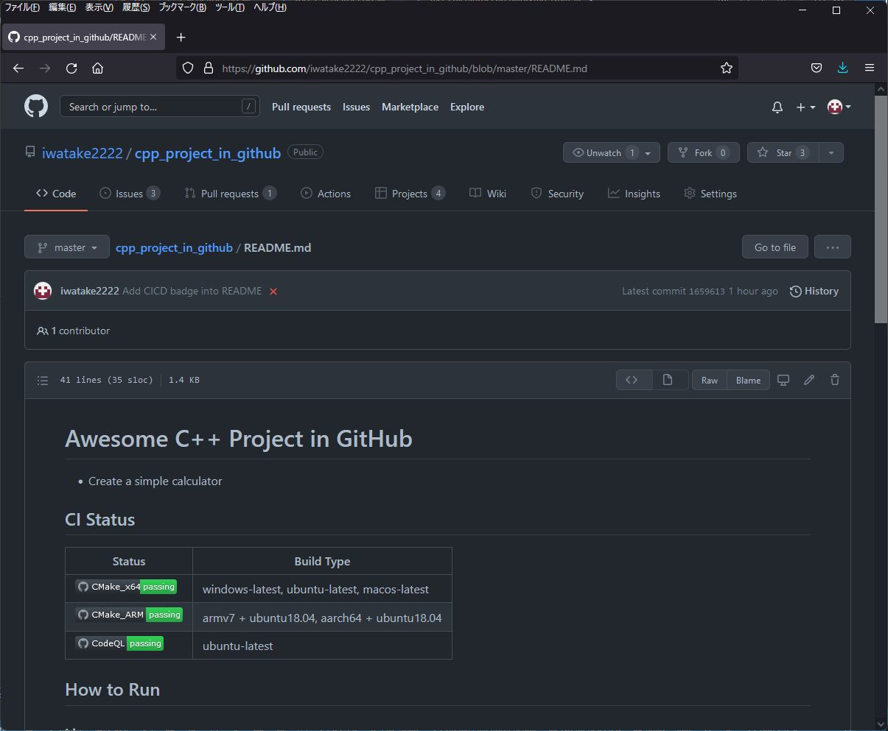

## マージしようとする
- 先ほどと同様に、マージします
- `git push origin feature-#11-codeql`
- GitHub上でプルリク発行
    - Close #11

## CodeQLの結果を確認する
- プルリクに紐づいたWorkflowが完了するのを待ちます
- リポジトリのトップページ -> Security -> View alertsをクリックします
- デフォルトだとmasterブランチの状態しか表示sれないので、Filterを以下のようにします
    - `is:open branch:master pr:12`
    - 最後の数字はプルリクの番号なので適宜変更してください
- すると、以下のように警告が出力されていることがわかります.
- また、プルリクのページを見ても、エラーが出ていることがわかります

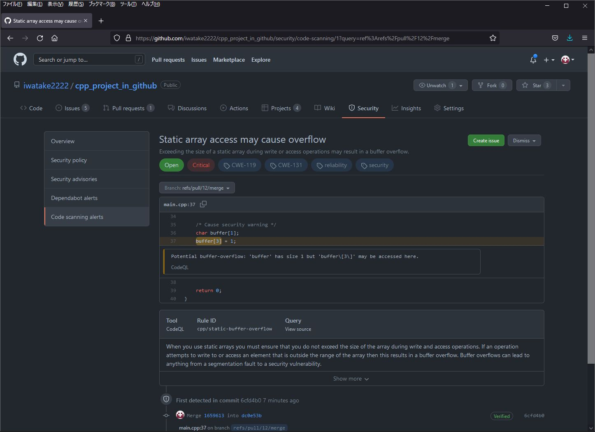

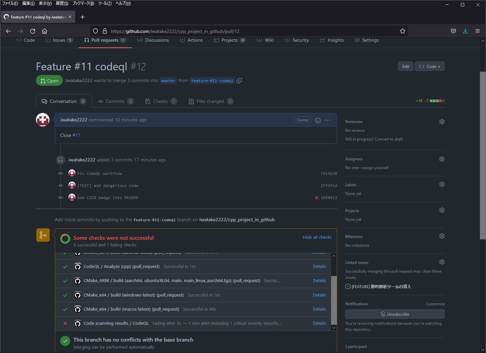

## CodeQLの警告を修正する
- 自分のPC上で先ほどmain関数に追加したバッファ外アクセスのコードを修正します
- 再度 `git push origin feature-#11-codeql` します
- プルリク発行しないでも、自動で再度workflowが走るので待ちます

## マージ完了する
- プルリクの画面で、全ての警告が消えたことを確認したらマージ、ブランチ削除
    - https://github.com/iwatake2222/cpp_project_in_github/pull/12
- `git checkout master`
- `git pull`

# その他の設定
- ここまでで、僕が思う、やっておいた方がいいかなという設定は終わりです
- 他には以下のような設定もしていいかもしれません
    - masterブランチへの直push禁止
    - GitHub Pagesとの連携

# 開発を進める
- ちなみに現時点での進捗はこんな感じです。ほぼ開発環境の整備が終わっただけで、実装はハローワールドしか出来ていないので、これから頑張らないといけません

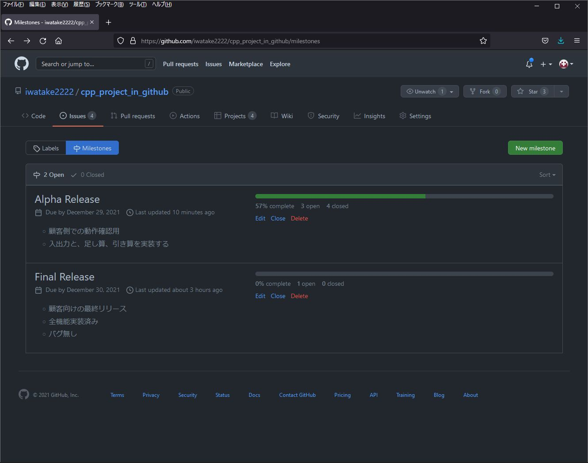

## 開発を進める自分ルール
1. Issueを立てる
    - milestone, projectsに追加する
    - すぐに作業を始めるのなら、KANBAN(Projects ボード)上で In progressに移動する
2. 以下のルールでmasterからブランチを切る
    - 機能追加の場合: `git checkout -b feature-#123-ooo`
    - バグ修正の場合: `git checkout -b fix-#123-ooo`
        - `#` は無いほうがいいかも
3. 機能を実装する
4. テストを実装してpassさせる
5. pushする
    - `git add .` , `git commit -m "ooo"`
    - `git push origin feature-#123-ooo`
6. GitHub上でプルリクを投げる
    - その際、コメントに`Close #123` または、`Fix #123` を記載
7. 誰かがレビューして、マージ
8. masterブランチに戻る
    - `git checkout master`
    - `git pull`

## リリース
- タグを付けてpushするだけ
    - `git tag 20211228`
    - `git push origin 20211228`
        - 一般的にはプリフィックスにvを付ける

## GoogleTestのもう少し複雑なバージョンのひな形
- 本記事はGitHubの設定がメインのため、ソフトウェア構造は単純にし、テストも簡単になっています
- 実際の開発では複数のモジュールが入り混じるため、DI (Dependency Injection)やMockが必要になります
- 下記プロジェクトでは、本記事と同じ電卓を、Prompt(入出力を管理するモジュール)、Arithmetic(計算をつかさどるモジュール)、Calculator(左記2つのモジュールを呼び出す)という3つのモジュールに分けて実装、テストしています
    - https://github.com/iwatake2222/googletest_test

